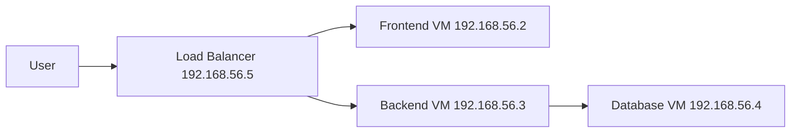

# Three-tier Web App Demo

A repository to demonstrate how Three-tier web application looks like. All applications in this repository are intentionally run without docker to demonstrate how applications are run traditionally.

## Architecture Diagram

## How to set up

1. Make sure Vagrant is installed. Follow [this documentation](https://developer.hashicorp.com/vagrant/docs/installation) to install it.
2. Clone this repository and `cd` into it.
3. Start all the VM by running `vagrant up`. It may take 5-10 minutes depending on your internet speed. This command will create 4 VMs with 1GB memory each and automatically install the required applications.
4. Access the app from `http://192.168.56.5`.
5. Run `vagrant destroy` to delete all VMs and clean up the project after you've done testing.

