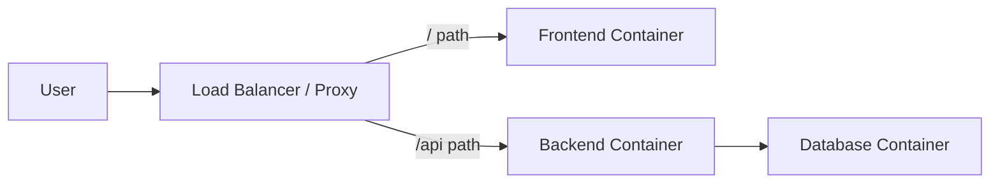

# Three-tier Web App Demo

After we learn to run the three-tier app in the VMs, let's try to use Docker to run it this time.

## Architecture Diagram

## How to set up

1. Make sure Docker and docker-compose is installed and ready to be used. Follow [this documentation](https://docs.docker.com/engine/install/) to install it.
2. Clone this repository and `cd` into `container-version` directory.
3. Build and start all the containers by running `docker compose up -d`. It may take 5-10 minutes to build the applications depending on your internet speed. This command will create 4 containers.
4. Verify if all of the containers are running by using `docker compose ps` command.
5. Open an interactive shell session to the backend session by running `docker compose exec -it backend sh`.
6. Run the `npx prisma migrate deploy` to run the database migration. This will create the required database schema to run the backend app.
7. Run the `npx prisma db seed` to create dummy data (optional).
8. Access the app from `http://localhost`.
9. Run `docker compose down -v` to delete all containers and volumes after you finished testing.
